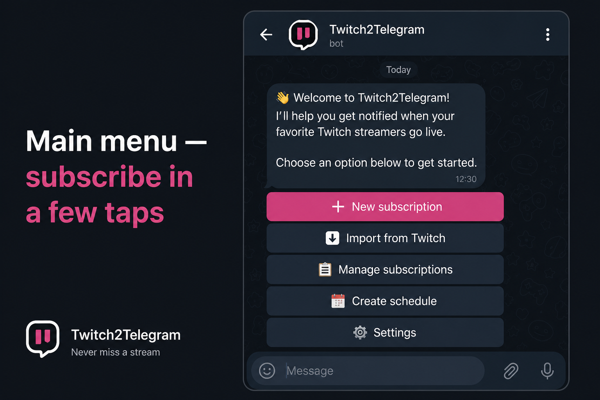
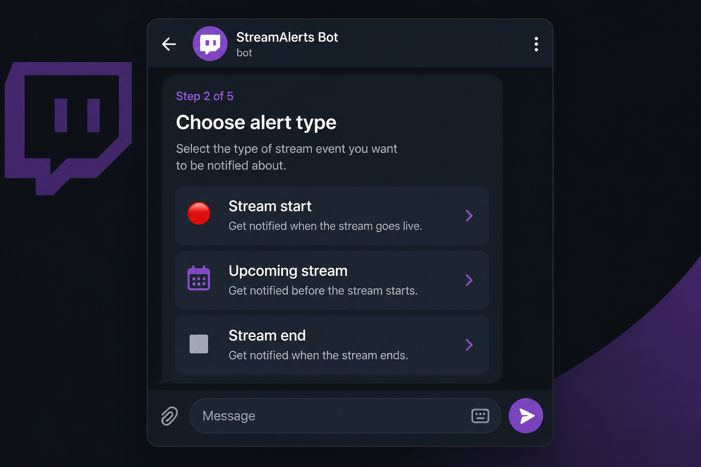
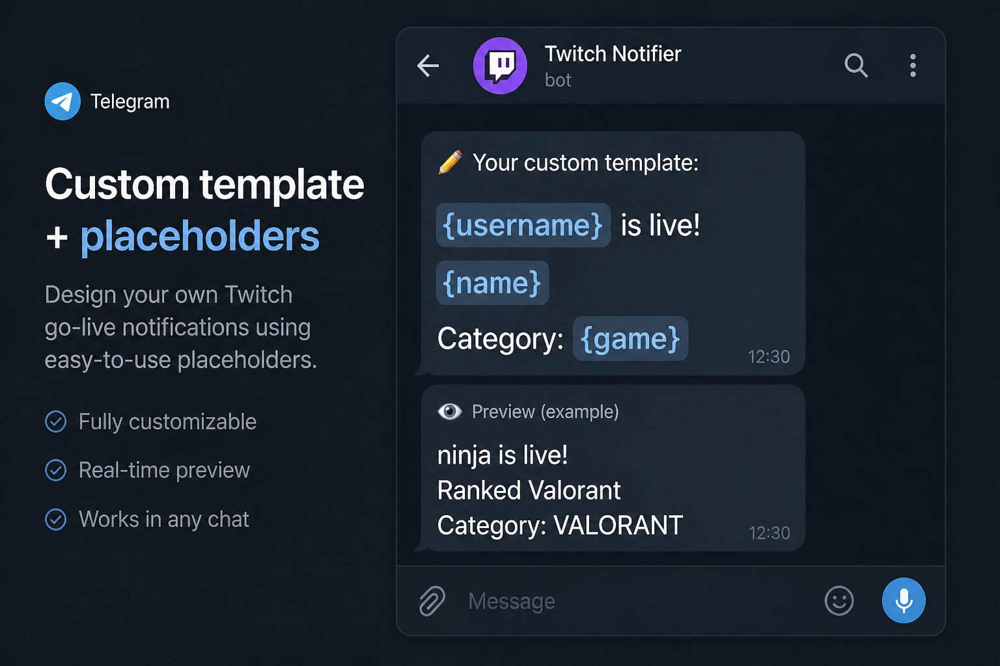
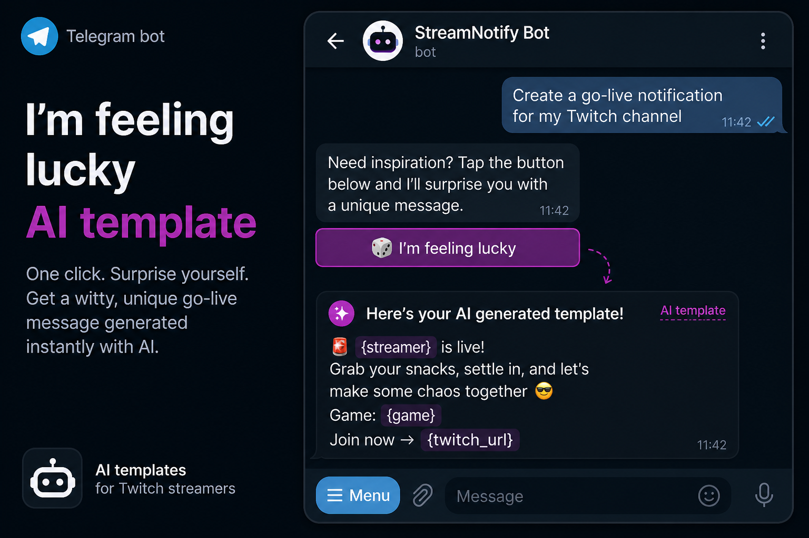
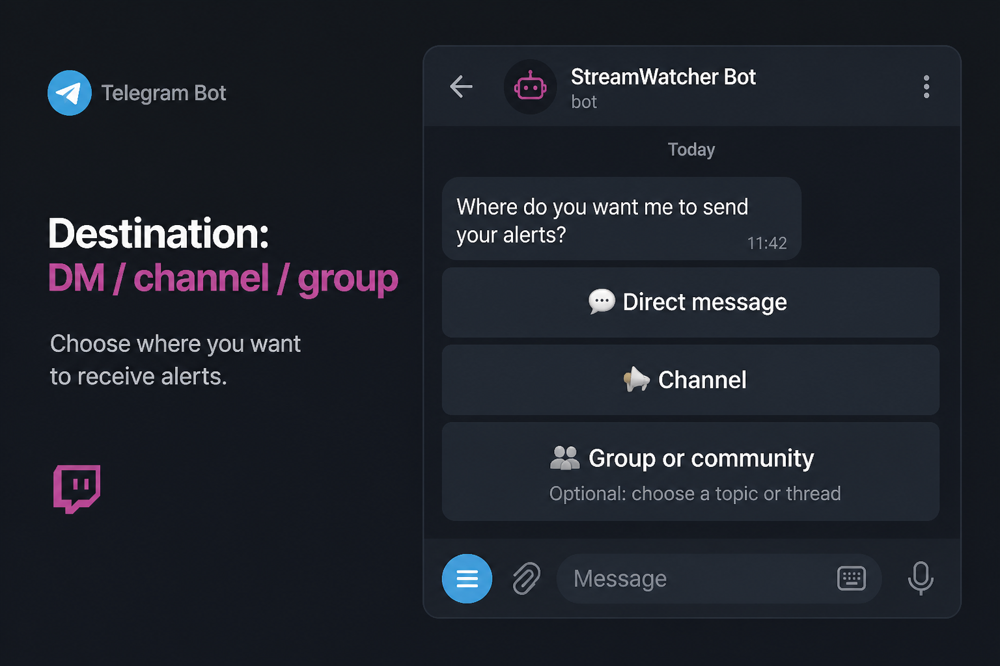
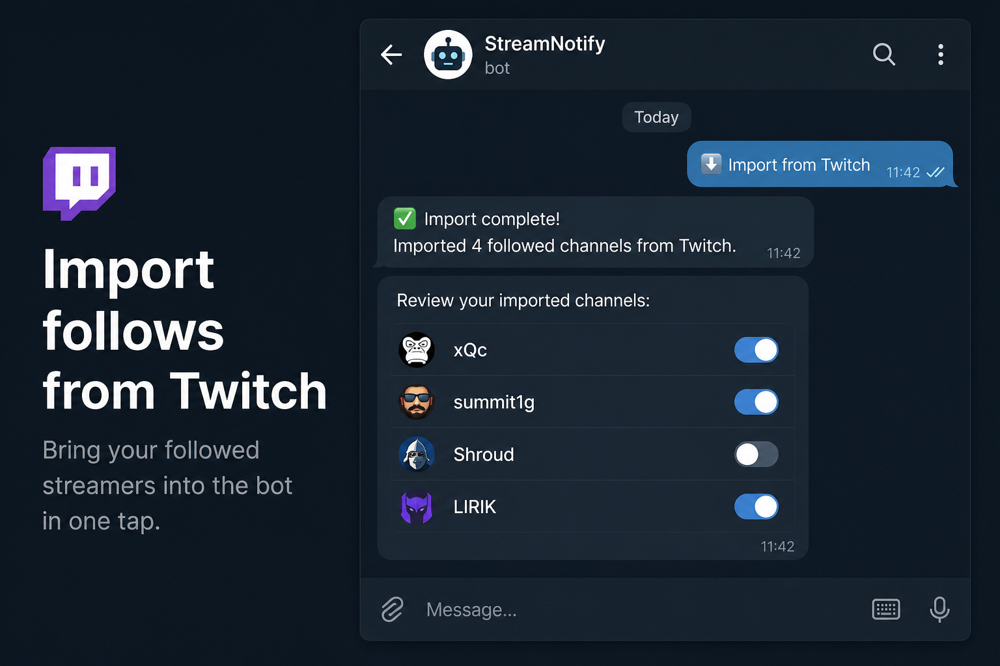

# Twitch → Telegram stream notifications

**Go-live, category change, upcoming, or stream end — the bot notifies wherever you choose.** Setup in Telegram.

Live bot: [@twitch2telegram_bot](https://t.me/twitch2telegram_bot)

Русский: [README.md](README.md)

| Main menu | Alert types |
|---|---|
|  |  |
| Custom template + placeholders | 🎲 I'm feeling lucky |
|  |  |
| Destination | Import from Twitch |
|  |  |

| Feature | How it works |
|---|---|
| Live bot | [@twitch2telegram_bot](https://t.me/twitch2telegram_bot) — `/start` for the menu |
| Languages | Russian and English — picked on first `/start`, change in **⚙️ Settings** |
| Alert types | Stream start · category change · upcoming (Twitch schedule) · stream end |
| Destinations | DM, channel, group or community (with topics) |
| Twitch channel | Link, `m.twitch.tv`, or username |
| Message template | Placeholders; examples `{username}`, `{game}`, `{name}` — [full list](https://bot.themarfa.name/placeholders?lang=en). In the editor: **Clean title** (checkbox) strips `@streamers` (only if the channel exists on Twitch) and `!commands` from `{name}` (off by default) |
| 🎲 I'm feeling lucky | One-tap AI template: **Groq → Hugging Face → local pool** (last 100) |
| 🎲 What to watch? | Saved filters to pick, new search, multi-select delete like subscriptions; categories → tags → viewers → language → mature |
| Image | Optional alert image — caption above or below; link preview then off |
| Delayed send | N minutes after go-live, category change, or going offline (Helix re-check before send) |
| Repeat suppression | For stream start: skip repeats for X minutes after the first alert |
| Schedule reminders | If the streamer has a Twitch schedule — remind N minutes before |
| Alert history | DM only: last 7 days free, 60 days with Premium (or pay-per-feature) |
| Subscriptions | List, edit all fields, enable/disable, delete |
| Import from Twitch | OAuth → one-time or periodic sync; new follows only, manual subs kept |
| Stream schedule | Main menu wizard for weekly text; publish to Twitch is **Premium** (slot duration, full clear of old slots) |
| System alerts | Toggle admin broadcasts (updates / availability / other); Twitch outages from status.twitch.com |
| Premium | 7-day trial; Stars month/year/lifetime; pay per feature (incl. 60-day history); Twitch channel sub (`PREMIUM_TWITCH_LOGIN`) |
| Partner program | Referral link, 10% of invitees’ Stars Premium, manual withdrawal requests |
| Admin | Background broadcast with type footer; “bot update” type also refreshes the main menu keyboard; DeepL, statistics, withdrawal handling, **Demo mode** |
| Analytics | [PostHog](https://posthog.com): usage events, Error tracking, Logs (WARNING+), daily `daily_bot_stats` (03:00 UTC) |
| Commands | `/start`, `/help`, `/cancel`, `/schedule`, `/feedback`, `/settings` |
| Deploy | VPS (Docker) |

## Quick Start

1. Create a bot via [@BotFather](https://t.me/BotFather) → `TELEGRAM_BOT_TOKEN`
2. Register an app at [Twitch Developer Console](https://dev.twitch.tv/console) → `TWITCH_CLIENT_ID`, `TWITCH_CLIENT_SECRET`
3. Copy `.env.example` to `.env` and fill in values
4. Run `docker compose up -d --build`

Local run:

```bash
python -m venv .venv && source .venv/bin/activate
pip install -r requirements.txt
python main.py
```

## Twitch API keys

1. [Twitch Developer Console](https://dev.twitch.tv/console) → **Register Your Application**
2. **OAuth Redirect URLs** — `https://<your-service>/oauth/twitch/callback` (for follow import; locally use public HTTPS via ngrok/`PUBLIC_BASE_URL`)
3. **Client ID** → `TWITCH_CLIENT_ID`
4. **New Secret** → `TWITCH_CLIENT_SECRET`

Live checks use **Client Credentials**. Follow import uses user OAuth (`user:read:follows`).

## Usage

On first `/start` the bot asks for a language (Russian or English), then shows the welcome text and **main menu**.

### New subscription

**➕ New subscription** — pick an alert type first:

| Type | What it does |
|---|---|
| Stream start | Notify when the channel goes live |
| Category change | Watches the stream start silently; notifies on every category change until the stream ends (no repeat-suppression step; **Premium**) |
| Upcoming stream | Remind N minutes ahead if the streamer has a Twitch schedule (error if none) |
| Stream end | Notify when the stream ends (same wizard, no repeat-suppression step) |

Then the wizard (for stream start / category change / stream end):

1. Twitch channel (if an alert already exists — open editor or continue)
2. Message template — write your own or tap **🎲 I'm feeling lucky** (AI)
3. Image (add / skip; if added — position: start or end of caption)
4. Ignore keywords (optional)
5. Link preview (skipped when an image is set)
6. Delay send (yes/no, minutes) — after go-live, category change, or after offline; Helix is re-checked before send
7. Allow repeat notifications (**stream start** only; yes/no; if no — mute minutes)
8. Destination: DM / channel / group or community
9. For channel or group — add the bot and confirm the chat
10. Delete previous bot message on each new alert? (yes/no; for category change defaults to its own alerts only; if other subs for the same streamer share the destination — asks whether to delete those too)

For **upcoming stream**, after the channel and schedule check — template and settings, then reminder minutes and destination (no “do you want reminders?” ask).

Each step has **Back**, **Cancel**, and **Main menu**. When editing a subscription — only those three reply buttons.

**Message template** — the wizard shows examples `{username}`, `{game}`, `{name}`. Full placeholder list (including `started_at`, `viewer_count`, `thumbnail_url`, `tags`, …): [`PUBLIC_BASE_URL/placeholders`](https://bot.themarfa.name/placeholders?lang=en) (prod: `https://bot.themarfa.name`). **Clean title** checkbox in the template editor (create and edit) strips streamer mentions and commands from `{name}`: removes `@username` when that streamer exists on Twitch, and `!command`-style tokens. Off by default; tapping does not close the editor.

**🎲 I'm feeling lucky** builds a template with placeholders. Chain: **Groq** (if keyed) → on failure **Hugging Face** → if both are down, a random template from the local DB pool (up to 100 recent successful generations per language). The Example block fills in a random [IGDB](https://api-docs.igdb.com/) game (same Twitch API credentials) and a stream title derived from it. After preview: continue, try again, or full wizard.

**Group or community** — send:
- topic link: `https://t.me/c/name/30`
- group `@username`
- group ID (`-100…`)
- forwarded message from the group (“Forwarded from: …”)

Bot permissions in a group: **send messages** (admin is not required). Also needs permission to **delete its own messages**.

After setup the bot sends **“✅ Setup complete!”** to DM and a test message to the chosen chat.

### What to watch?

**🎲 What to watch?** — random live streams matching your filters (available to everyone, no Premium).

If you have saved filters, the bot offers:

| Action | How |
|---|---|
| Pick a filter | Tap the name → get several streams |
| New search | Filter wizard from scratch |
| Delete filters | Separate button → multi-select (same pattern as subscription delete) → delete selected |

New search wizard:

1. Twitch categories (up to 5)
2. Stream tags (optional; stream must include all listed)
3. Viewer range
4. Stream language (optional)
5. Exclude mature or allow
6. Save filter for later (up to 5) or just this once

After suggestions: **Suggest again** / **Filters / new search**.

### Import from Twitch

**⬇️ Import from Twitch** — Twitch OAuth, then choose **one-time import** or **sync**:

- one-time — same as before, token not stored;
- sync — period in days, refresh token stored encrypted; each run adds new follows (**enabled**) and removes unfollowed imports (manual subscriptions untouched);
- on import, alerts are created **paused** (DM to self); Settings → **Subscription sync** (change period / disable).

Twitch Console needs Redirect URL: `https://<service>/oauth/twitch/callback` (see `PUBLIC_BASE_URL`).

### Stream schedule

**📅 Create schedule** on the main menu (everyone) — wizard for publication text for the upcoming week (nearest Monday through Sunday):

1. Description and format example
2. Confirm “Create the schedule?”
3. For each day: game/stream title and time (`15:30`)
4. **No stream planned** — skip the day
5. From day 2 — **Finish schedule** (not shown on the last day)

Result — ready-to-post text, for example:

```
- 20 Jul 15:30 Sovereign Syndicate
- 21 Jul 18:00 Just Chatting
```

Dates and month names follow the user’s language.

Optionally **publish to Twitch** (**Premium**):

1. Slot duration: 1–4 h or “Not sure” (default 2 h)
2. OAuth / saved token with `channel:manage:schedule`
3. All existing channel schedule segments are deleted before creating new ones
4. Segments are one-off (Partner/Affiliate) or weekly recurring (fallback)

### Menu and commands

| Button / command | Action |
|---|---|
| `/start` | Main menu |
| `/help` | Help |
| `/cancel` | Cancel current wizard |
| `/schedule` | Create schedule |
| `/feedback` | Feedback |
| `/settings` | Settings |
| ➕ New subscription | Alert type → wizard |
| ⬇️ Import from Twitch | OAuth → one-time or sync |
| 📋 Manage subscriptions | List, edit, delete |
| 📅 Create schedule | Weekly text; Twitch sync — Premium |
| 🎲 What to watch? | Pick filter / new search / delete filters |
| 📜 Alert history | DM: 7 days free / 60 days Premium |
| ⚙️ Settings | Premium, sync, system alerts, language, partner program |
| ↳ ⭐ Premium | Stars or free via Twitch channel sub |
| ↳ 🤝 Partner program | Stats, link, withdraw (≥ 500 Stars), your requests |
| ↳ 🔔 System notifications | Bot update, availability (bot / Twitch status), and sync alerts |
| ↳ 🌐 Language | Russian / English |
| ⚙️ Admin | Broadcast, stats, withdrawals, demo mode (`ADMIN_USER_IDS` only) |
| ↳ 📣 Broadcast | “Bot updates”, “Bot availability”, or “Other”, scheduled send; footer with type and how to disable in Settings |
| ↳ 💸 Withdrawals | Partner requests: ✅ paid / ❌ reject (balance restored) |
| ↳ 📊 Statistics | Users, subscriptions, languages, paid Premium; same snapshot sent daily to PostHog (`daily_bot_stats`) |
| ↳ 🎬 Demo mode | Start from Admin: free-user menu without Premium, demo subscriptions; **Admin is hidden**, «Demo mode» stays on the main menu — press again to exit and wipe all demo data |
| 🐛 Report a problem | @immarfa or [Issues](https://github.com/Marfa/twitch-telegram-bot/issues) |

### Partner program

In **⚙️ Settings → 🤝 Partner program**:

1. **Get link** — `t.me/<bot>?start=ref_<your_id>`
2. Invitee opens the link → referrer is bound once
3. Each **Stars Premium** payment / renewal by the invitee credits **10%** Stars to the partner balance
4. **Request withdrawal** — full available balance if ≥ 500 Stars; admin gets a request with action buttons
5. **My requests** — statuses: pending / paid / rejected

Commission applies only to Stars Premium (not Twitch-sub Premium or external donations). Telegram Bot API cannot transfer Stars to users — the admin pays out manually and marks the request in the bot.

Weekly admin report: new users + Stars payers for the week.

**Edit subscription** — same order as creation: template (**Clean title** checkbox), image, ignore keywords, link preview (hidden when an image is set), delay, repeats (not for category change or stream end), schedule reminders (if enabled at creation), destination, delete old messages. For **category change** with delete enabled — a separate «delete other alerts too» option.

Notification template example:

```
{username} is live!
{name}
Category: {game}
```

## Deploy

### VPS (auto-deploy)

Server checkout: `/opt/twitch-telegram-bot` (with `.env` beside it).

On push to `main`, GitHub Actions SSHs in, runs `git fetch` + `reset --hard origin/main`, then `scripts/vps-deploy.sh`: `docker compose -f compose.vps.yml up -d --build`, `/health` check, nightly pg-backup cron. Secrets: `VPS_HOST`, `VPS_USER`, `VPS_SSH_KEY`.

Manual run: Actions → **Deploy VPS** → **Run workflow**.

VPS `.env` needs `POSTGRES_PASSWORD` (Postgres via `compose.vps.yml`) and `PUBLIC_BASE_URL` for OAuth (e.g. `https://bot.themarfa.name`).

### Local / Docker

Leave `DATABASE_URL` unset — SQLite is used (`DATABASE_PATH`, volume in `compose.yml`).

## Environment variables

| Variable | Description |
|---|---|
| `TELEGRAM_BOT_TOKEN` | BotFather token |
| `TWITCH_CLIENT_ID` | Twitch Client ID |
| `TWITCH_CLIENT_SECRET` | Twitch Client Secret |
| `ADMIN_USER_IDS` | Admin Telegram user IDs (comma-separated) |
| `CHECK_INTERVAL` | Twitch live poll interval, seconds (default 60) |
| `SCHEDULE_CHECK_INTERVAL` | Twitch schedule reminder poll, seconds (default 180) |
| `POSTGRES_PASSWORD` | Postgres password on VPS (`compose.vps.yml`) |
| `DATABASE_URL` | PostgreSQL. If unset — SQLite (`compose.vps.yml` sets it) |
| `DATABASE_PATH` | SQLite: local `data/bot.db`, Docker `/data/bot.db` |
| `MAX_SUBSCRIPTIONS_PER_OWNER` | Subscription limit per user (default 25) |
| `PREMIUM_FREE_ACTIVE_LIMIT` | Active alerts without Premium (default 5) |
| `PREMIUM_STARS_AMOUNT` | Monthly Stars subscription (default 100) |
| `PREMIUM_STARS_YEAR` | Yearly Stars one-shot (default 1000) |
| `PREMIUM_STARS_LIFETIME` | Lifetime Premium Stars (default 2000) |
| `PREMIUM_STARS_FEATURE` | Per-feature monthly Stars (default 20) |
| `PREMIUM_TRIAL_DAYS` | Trial length in days (default 7) |
| `PREMIUM_SUBSCRIPTION_PERIOD` | Stars subscription period, seconds (default 2592000 ≈ 30 days) |
| `PREMIUM_TWITCH_LOGIN` | Twitch login for free Premium via sub (default `marfapr`) |
| `REFERRAL_COMMISSION_PERCENT` | Partner commission on Stars Premium, % (default 10) |
| `REFERRAL_WITHDRAW_MIN_STARS` | Minimum withdrawal request, Stars (default 500) |
| `PUBLIC_BASE_URL` | Public HTTPS origin: OAuth (`…/oauth/twitch/callback`) and placeholder docs (`…/placeholders`). Prod: `https://bot.themarfa.name` |
| `TOKEN_ENCRYPTION_KEY` | Optional Fernet key for refresh tokens (else derived from `TELEGRAM_BOT_TOKEN`) |
| `PORT` | Health/OAuth port (default 8080) |
| `DEEPL_API_KEY` | DeepL — auto-translate admin broadcasts to recipient language |
| `GROQ_API_KEY` | Groq — primary LLM for **I'm feeling lucky** (aliases: `GROQ_API`, `GROK_API`) |
| `GROQ_TEXT_MODEL` | Groq model (default `llama-3.1-8b-instant`) |
| `HF_TOKEN` | Hugging Face — fallback LLM (alias: `HUGGING_FACE_API`) |
| `HF_TEXT_MODEL` | HF model (default `Qwen/Qwen2.5-7B-Instruct`) |
| `POSTHOG_API_KEY` | PostHog **Project API key** (`phc_…`). Analytics off if unset |
| `POSTHOG_HOST` | Ingestion host (default `https://us.i.posthog.com`; EU: `https://eu.i.posthog.com`) |

Without Groq/HF keys, **I'm feeling lucky** still works from the local template pool in the DB.

### PostHog

Optional. Use the **Project API key** (`phc_…`) from Project settings → Project variables (not Personal `phx_` or Project secret `phs_`).

| What | Where in PostHog |
|---|---|
| `/start`, alerts, import, premium, blocks | Activity / Product analytics → Trends |
| Unhandled exceptions | Error tracking |
| `logger.warning` / `logger.error` / `exception` | Logs (`service.name=twitch-telegram-bot`, no INFO) |
| Admin stats snapshot | `daily_bot_stats` event daily at 03:00 UTC |

`daily_bot_stats` properties: `users`, `notify_users`, `unique_owners`, `subscriptions_*`, `unique_twitch_channels`, `premium_paid`, `blocked_users`, `sys_*`, `locale_*`.

One-shot snapshot / approximate backfill: `python scripts/posthog-stats-snapshot.py [--backfill]` (on VPS inside the bot container).

## Architecture

| Module | Role |
|---|---|
| `bot.py` | Wizard, menu, notifications, What to watch?, admin broadcast, Twitch Status, partner program, schedule |
| `analytics.py` | PostHog: usage events, errors, WARNING+ Logs, daily `daily_bot_stats` |
| `i18n.py` | Strings and keyboards (ru/en) |
| `premium.py` / `premium_handlers.py` | Premium (Stars / Twitch), referral credits |
| `demo_mode.py` | Admin Demo mode flag (free UX + wipe demo subscriptions) |
| `hf_text.py` | AI templates: Groq → HF → local pool |
| `twitch.py` | Helix API, live discovery, templates, status.twitch.com |
| `translate.py` | DeepL for admin broadcasts |
| `links.py` | `t.me/c/…/topic` parsing |
| `health.py` | `/health`, `/placeholders`, Twitch OAuth callback |
| `db.py` | SQLite or PostgreSQL, `lucky_templates` pool, watch filters, referrals |

Twitch Helix poll ~60 s, Statuspage ~120 s, Telegram polling, no public webhook.

## License

**CC BY-NC-SA 4.0** — see [LICENSE](LICENSE)

---

Built with Cursor

Support: [Donate](https://www.donationalerts.com/r/themarfa) · [Crypto](https://nowpayments.io/donation/themarfa) · [Telegram Tribute](https://t.me/tribute/app?startapp=dBlc)
