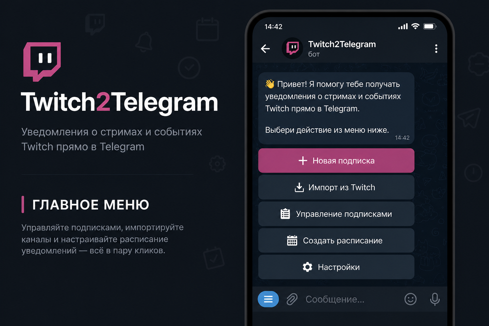
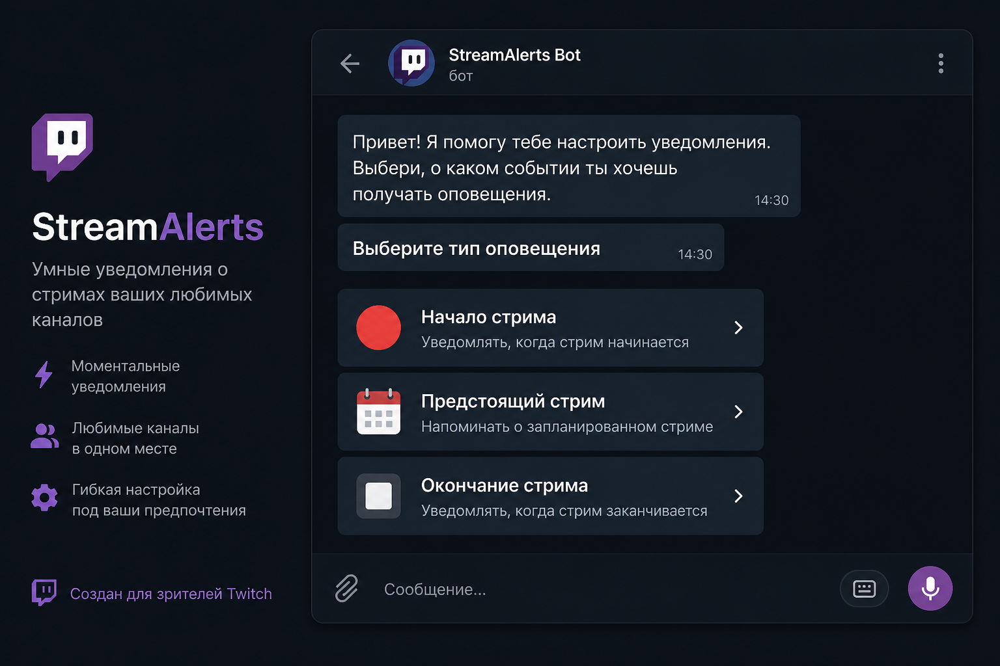
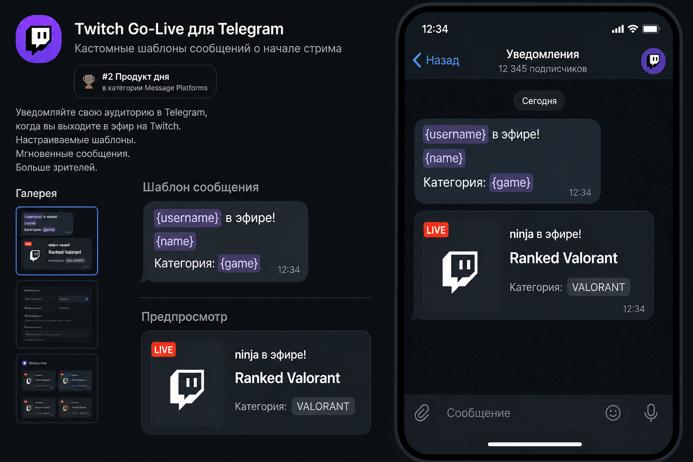
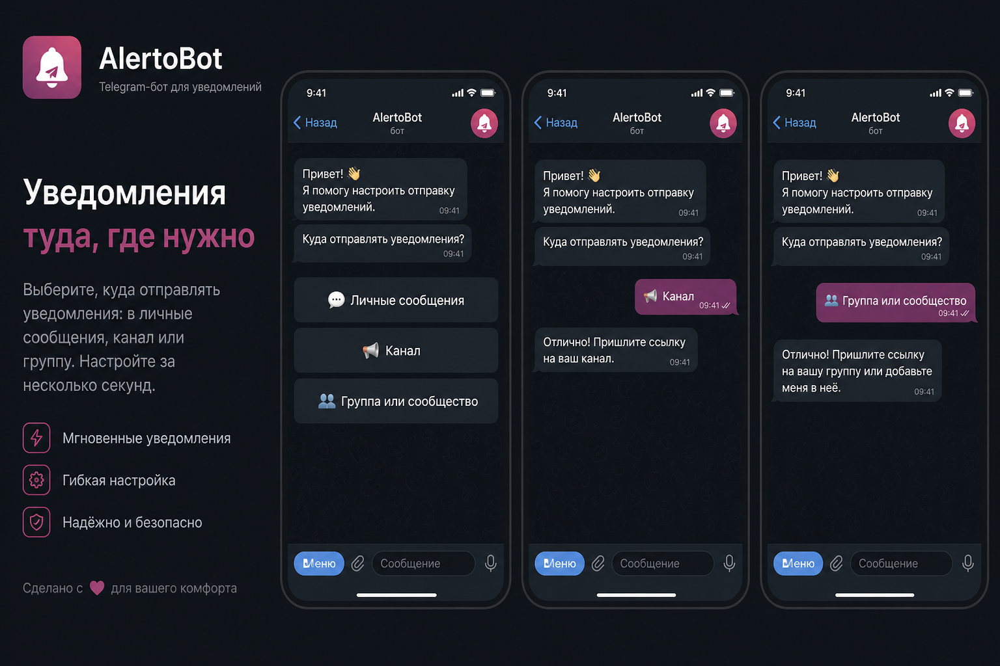
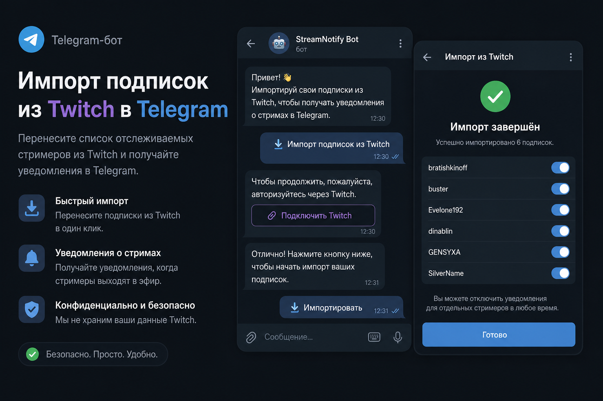

# Twitch → Telegram — уведомления о стримах

**Старт, смена категории, скоро стрим или конец эфира — бот напишет туда, куда вы скажете.** Настройка в Telegram.

> [!IMPORTANT]
> **Готовый бот:** [@twitch2telegram_bot](https://t.me/twitch2telegram_bot) — `/start` и меню

English: [README.en.md](README.en.md)

| Главное меню | Типы оповещений |
|---|---|
|  |  |
| Шаблон + плейсхолдеры |
|  |
| Куда слать | Импорт из Twitch |
|  |  |

| Возможность | Как работает |
|---|---|
| Готовый бот | [@twitch2telegram_bot](https://t.me/twitch2telegram_bot) — `/start` и меню |
| Языки | Русский и English — выбор при первом `/start`, смена в **⚙️ Настройки** |
| Типы оповещений | Начало стрима · смена категории · предстоящий (Twitch schedule) · окончание стрима |
| Куда слать | Личка или канал/группа/сообщество (с темами) |
| Канал Twitch | Ссылка, `m.twitch.tv` или username; ссылка в ЛС вне мастера → предложение создать оповещение |
| Текст | Шаблон с плейсхолдерами; примеры `{username}`, `{game}`, `{name}` — [полный список](https://bot.themarfa.name/placeholders?lang=ru). **Очистка названия** — в «Дополнительно» при создании и в меню редактора при правке: убирает из `{name}` `@стримеров` (если канал есть на Twitch) и `!команды` (по умолчанию выкл) |
| 🎲 Что посмотреть? | В **📦 Прочее**: сохранённые фильтры; live → иначе VOD; «Мне повезёт» (live → VOD по тем же играм); ловить новые стримы по фильтру |
| Картинка | Опционально к уведомлению — в начале или в конце подписи; превью ссылок тогда выкл |
| Отложенная отправка | Через N минут после старта, смены категории или после ухода офлайн (с перепроверкой Helix); шаг мастера — в **продвинутом режиме** |
| Заглушка повторов | Для старта стрима: не слать повторно X минут после первого уведомления; шаг мастера — в **продвинутом режиме** |
| Напоминания по schedule | Если у стримера есть официальное расписание Twitch — напомнить за N минут |
| История оповещений | В ЛС: за 7 дней бесплатно, за 60 дней — Premium (или оплата функции); пометки просмотрено / не просмотрено и «просмотрено всё ниже» |
| Продвинутые опции | На экране **Дополнительно** у всех: изображение, очистка названия, игнор, отложенная отправка, заглушка повторов, удаление предыдущих, **пользовательские кнопки** (⭐ Premium / 🧪 бета), кнопка чата, превью ссылок (если URL в шаблоне; выкл при картинке/кнопке чата) |
| Подписки | **📋 Мои подписки** в главном меню: список с пагинацией; у каждой — вкл/выкл, редактирование, удаление, **Поделиться** (🧪 бета); **🧺 Корзина** и **⏸ Приостановить оповещения** в нижнем меню; **💬 Чат стримов** — Mini App с embed/fallback |
| Импорт из Twitch | OAuth → разово или синхронизация; только новые фолловы, ручные подписки не трогает |
| Расписание стримов | **📅 Управление расписанием** в **📦 Прочее**: недельный мастер или **поправить слоты на день**, **Часовой пояс** (UTC); публикация на Twitch — **Premium** |
| Системные оповещения | Вкл/выкл рассылок об обновлениях, доступности и прочих; падения Twitch (status.twitch.com); оповещения о проблемах Cursor (status.cursor.com) — только админам |
| Премиум | Триал / Stars месяц·год·lifetime / à la carte / саб Twitch / премиум-канал — см. [Premium](#premium) |
| Партнёрка | Реферальная ссылка, 10% от Stars Premium приглашённых, заявки на вывод (вручную) |
| Админка | Рассылка в фоне; отложенная; статистика; DeepL; выводы; refund по charge_id; демо; **ежедневный дайджест новых Premium-оплат** (источник из аналитики) |
| Аналитика | [PostHog](https://posthog.com): usage-события, Error tracking, Logs (WARNING+), ежедневный `daily_bot_stats` (03:00 UTC) |
| Команды | `/start`, `/help`, `/cancel`, `/schedule`, `/feedback`, `/settings` |
| Deploy | VPS (Docker) |

## Premium

Тарифы Stars (Telegram) и функции. Полный план открывает всё из таблицы функций.

| Тариф | Stars | Срок |
|---|---:|---|
| Триал | 0 | 7 дней (один раз) |
| Месяц | 100 | 30 дней, автопродление |
| Год | 1000 | 365 дней |
| Lifetime | 2000 | бессрочно |
| Одна функция | 20 | 30 дней за каждую |
| Премиум-канал стримера | 1500 | разовый, для канала |

Также: саб на Twitch-канал `PREMIUM_TWITCH_LOGIN` (по умолчанию `marfapr`) даёт полный Premium без Stars.

| Функция | Что даёт |
|---|---|
| Активных оповещений больше 5 | Снимает лимит 5 активных оповещений на бесплатном плане |
| Типы кроме старта стрима | Смена категории, предстоящий по schedule, конец эфира |
| Автосинхронизация фолловов Twitch | Периодический импорт новых / удаление отфолловленных |
| Продвинутые опции оповещений | Игнор слов, отложенная отправка, заглушка повторов, удаление предыдущих |
| Публикация расписания на Twitch | Слоты из бота → страница schedule канала |
| История оповещений за 60 дней | На бесплатном — 7 дней |
| Корзина удалённых подписок на 30 дней | На бесплатном — 10 дней |
| Безлимитный чат стримов в Mini App | На бесплатном — чтение + 20 сообщений/день |
| Премиум-канал для стримеров | Бесплатные взаимодействия с ботом для зрителей, приоритет в «Что посмотреть?», welcome-рекомендация |

Цены задаются env: `PREMIUM_STARS_AMOUNT`, `PREMIUM_STARS_YEAR`, `PREMIUM_STARS_LIFETIME`, `PREMIUM_STARS_FEATURE`, `PREMIUM_CHANNEL_STARS`, `PREMIUM_TRIAL_DAYS`, `PREMIUM_FREE_ACTIVE_LIMIT`.

## Quick Start

1. Бот у [@BotFather](https://t.me/BotFather) → `TELEGRAM_BOT_TOKEN`
2. Приложение на [Twitch Developer Console](https://dev.twitch.tv/console) → `TWITCH_CLIENT_ID`, `TWITCH_CLIENT_SECRET` (см. ниже)
3. `cp .env.example .env` — заполните переменные
4. `docker compose up -d --build`

Локально:

```bash
python -m venv .venv && source .venv/bin/activate
pip install -r requirements.txt
python main.py
```

## Twitch API ключи

1. [Twitch Developer Console](https://dev.twitch.tv/console) → **Register Your Application**
2. **OAuth Redirect URLs** — `https://<ваш-сервис>/oauth/twitch/callback` (для импорта фолловов; локально — публичный HTTPS через ngrok/`PUBLIC_BASE_URL`)
3. **Client ID** → `TWITCH_CLIENT_ID`
4. **New Secret** → `TWITCH_CLIENT_SECRET`

Опрос стримов идёт через **Client Credentials**. Импорт подписок из Twitch — через user OAuth (`user:read:follows`).

## Использование

При первом `/start` бот предложит выбрать язык (русский или English), затем покажет приветствие и **главное меню**.

### Новая подписка

**➕ Новая подписка** — сначала тип оповещения (тот же мастер стартует, если в ЛС прислать ссылку `twitch.tv` вне мастера):

| Тип | Что делает |
|---|---|
| Начало стрима | Уведомление, когда канал выходит в эфир |
| Смена категории | Ловит старт стрима без оповещения; шлёт при каждой смене категории до конца стрима (без шага про повторы; **Premium**) |
| Предстоящий стрим | Напоминание за N минут, если у стримера есть Twitch schedule (без расписания — ошибка) |
| Окончание стрима | Уведомление, когда стрим завершился (тот же мастер, без шага про повторы) |

Дальше мастер (для начала / смены категории / окончания стрима):

1. Канал Twitch (если оповещение уже есть — предложит редактор или продолжить)
2. Формат сообщения — свой текст с плейсхолдерами
3. **Дополнительно** — чеклист: изображение, очистка названия, игнор ключевых слов ⭐, отложенная отправка ⭐, заглушка повторов ⭐ (начало стрима), удалять предыдущие в канале/группе ⭐, кнопка чата, превью ссылок (если в шаблоне есть URL); у бесплатных ⭐-опции видны, но не включаются; неотмеченные шаги пропускаются; превью тихо выключается при изображении или кнопке чата
4. Картинка (если отмечено) — загрузка и позиция: в начале или в конце
5. Превью ссылок (шаг пропускается, если есть картинка)
6. Отложить отправку (минуты) — если отмечено; после старта / смены категории / офлайна, перед отправкой Helix перепроверяется
7. Заглушка повторов (минуты) — если отмечено; только **начало стрима**
8. Куда слать: личка или канал/группа (одна кнопка)
9. Для канала или группы — добавьте бота и подтвердите чат
10. Удалять предыдущие сообщения бота? — если отмечено (для смены категории по умолчанию только свои; если есть другие подписки на того же стримера в тот же чат — спросит, удалять ли и их)

Шаги 4 / 6 / 7 / 10 — только после отметки на «Дополнительно» (и Premium для ⭐). Кнопка чата, очистка названия и изображение бесплатны.

Для **предстоящего стрима** после канала и проверки schedule — шаблон и настройки, затем минуты напоминания и куда слать (без отдельного вопроса «нужны ли напоминания»).

На каждом шаге доступны **« Назад**, **Отмена** и **Главное меню**. При редактировании подписки — только эти три кнопки.

**Шаблон сообщения** — в мастере показаны примеры `{username}`, `{game}`, `{name}`. Полный список плейсхолдеров (в т.ч. `started_at`, `viewer_count`, `thumbnail_url`, `tags`, …): [`PUBLIC_BASE_URL/placeholders`](https://bot.themarfa.name/placeholders?lang=ru) (прод: `https://bot.themarfa.name`). **Очистка названия**: при создании — на экране **Дополнительно**; при правке — в меню редактора (те же подписи, что в «Дополнительно»). Включает очистку `{name}` — убираются `@username`, если такой стример есть на Twitch, и команды вида `!команда`. По умолчанию снято.


**Группа или сообщество** — отправьте:
- ссылку на группу: `https://t.me/название` (без темы — в общий чат)
- ссылку на тему: `https://t.me/c/название/30`
- `@username` группы
- ID группы (`-100…`)
- пересланное сообщение из группы («Переслано из: …»)

Права бота в группе: **отправка сообщений** (для алертов админ не обязателен). Нужно право **удалять свои сообщения**. На этапе привязки бот должен быть **администратором** — иначе Telegram не даст проверить, что вы тоже админ; после привязки админка боту не обязательна, если остаются права на отправку и удаление.

При включённом «удалять старые» бот чистит прошлое оповещение перед новым и сам удаляет его примерно через 47 часов (лимит Telegram ~48 ч), не дожидаясь следующего стрима.

После настройки бот пришлёт **«✅ Настройка завершена!»** в личку и тестовое сообщение в выбранный чат.

### Что посмотреть?

**🎲 Что посмотреть?** (в **📦 Прочее**) — подбор случайных live-стримов по вашим фильтрам (доступно всем, без Premium). Если live нет — недавние VOD по тем же категориям.

Если есть сохранённые фильтры, бот предложит:

| Действие | Как |
|---|---|
| Выбрать фильтр | Нажать на имя → сразу несколько стримов |
| Новый поиск | Мастер фильтров с нуля |
| Удалить фильтры | Отдельная кнопка → отметить нужные (как удаление подписок) → удалить выбранные |

Мастер нового поиска:

1. Категории Twitch (до 5) — или **🎲 Мне повезёт** (IGDB random ×5 → live; recently released ×5 → live; IGDB top-100 ×5 → live; если пусто — VOD по тем же играм; язык бота / любой; 18+ разрешены)
2. Теги стрима (опционально; стрим должен содержать все указанные)
3. Диапазон зрителей
4. Язык стрима (опционально)
5. Исключить 18+ или нет
6. Сохранить фильтр на потом (до 5) или только сейчас

После подборки (или пустого результата):

| Кнопка | Действие |
|---|---|
| **Ловить новые стримы по фильтру?** | Оповещение «Начало стрима» по текущему фильтру (категории Helix); настройки по умолчанию, только удаление |
| **Ещё варианты** | Новый случайный набор |
| **Фильтры / новый поиск** | Снова выбор / мастер |

Бот периодически опрашивает live по `game_id` и пишет, когда появляется **новый** стрим, подходящий под фильтр.

### Импорт из Twitch

**⬇️ Импорт подписок** — OAuth на Twitch, затем выбор: **одноразовый импорт** или **синхронизация**:

- одноразовый — как раньше, токен не сохраняется;
- синхронизация — период в днях, refresh token хранится зашифрованно; раз в период добавляются новые фолловы (сразу **включены**) и удаляются неотредактированные sync-импорты при отписке; если оповещение **редактировали** или оно **ручное** — бот спрашивает «Удалить оповещения?» (Да / Нет);
- при импорте оповещения создаются **на паузе** (DM себе); в Настройках — **Синхронизировать** (период / отключить).

В Twitch Console нужен Redirect URL: `https://<сервис>/oauth/twitch/callback` (см. `PUBLIC_BASE_URL`).

### Расписание стримов

**📅 Управление расписанием** в **📦 Прочее** (доступно всем) — выбор режима:

| Режим | Что делает |
|---|---|
| **Создать расписание на неделю** | Мастер текста с понедельника по воскресенье |
| **Поправить слоты на день** | Выбрать один день → игра → время → публикация; при синхронизации на Twitch очищаются слоты только этого дня |
| **Часовой пояс** | Указать UTC (`UTC+3`, `UTC-5`, …); сохраняется для публикации на Twitch |

**Недельный мастер:**

1. Описание и пример формата
2. Подтверждение «Сформировать расписание?»
3. Для каждого дня: игра/название стрима и время (`15:30`) — в **вашем** часовом поясе
4. **Стрим не планируется** — пропустить день
5. Со 2-го дня — **Завершить** (на последнем дне кнопки нет)

Итог — готовый текст, например:

```
- 20 июля 15:30 Sovereign Syndicate
- 21 июля 18:00 Just Chatting
```

Даты и месяцы на языке пользователя.

Опционально — **опубликовать на Twitch** (**Premium**):

1. Подтверждение «Опубликовать расписание на Twitch?»
2. Если часовой пояс ещё не задан — запрос UTC (пример: Москва `UTC+3`)
3. Длительность слота: 1–4 ч или «Не уверен» (по умолчанию 2 ч)
4. OAuth / сохранённый токен с правом `channel:manage:schedule`
5. Перед созданием слотов текущие сегменты удаляются (полная очистка при недельном режиме; только выбранный день при «Поправить слоты на день»)
6. Слоты создаются как разовые (Partner/Affiliate) или еженедельные recurring (fallback); время уходит в Helix с выбранным UTC

### Корзина удалённых подписок

При удалении подписки (вручную или при синхронизации с Twitch) она сохраняется в корзину. В **📋 Мои подписки** есть **🧺 Корзина**:

- При нескольких типах оповещений — сначала выбор типа (как в просмотре / редактировании / удалении)
- Список удалённых подписок за последние **10 дней** (бесплатно) или **30 дней** (Premium / à la carte)
- Мультивыбор + **♻️ Восстановить выбранные**
- При превышении лимита подписок — частичное восстановление с сообщением

### Чат стримов Twitch

Menu Button **Чат** слева у поля ввода (ставится всем при деплое) и **📦 Прочее → 💬 Чат** → Mini App: онлайн из активных подписок, поиск по имени/ссылке, чат стрима (Twitch embed + простой fallback). Бесплатно: чтение + до 20 сообщений в сутки; Premium-функция `stream_chat` / полный план — без лимита.

### Приостановить оповещения

В **📋 Мои подписки** есть **⏸ Приостановить оповещения**: указать число дней (0 — снова включить). Подписки остаются активными; бот не доставляет стримовые и системные сообщения до указанной даты.

### Меню и команды

| Кнопка / команда | Действие |
|---|---|
| `/start` | Главное меню |
| `/help` | Справка |
| `/cancel` | Отменить текущий мастер |
| `/schedule` | Управление расписанием |
| `/feedback` | Обратная связь |
| `/settings` | Настройки |
| ➕ Новая подписка | Тип оповещения → мастер |
| ⬇️ Импорт подписок | OAuth → разово или синхронизация |
| 📋 Мои подписки | Список с вкл/выкл, редактированием, удалением, шарингом; **🧺 Корзина**; **⏸ Приостановить оповещения** |
| 📜 История оповещений | ЛС: 7 дней free / 60 дней Premium; 🙄/🫣 просмотр, «просмотрено всё ниже» |
| 📦 Прочее | Оповещения об ЛС, расписание, что посмотреть, чат |
| ↳ 💬 Оповещения об ЛС | Вкл. после OAuth Twitch; в Telegram — отправитель, текст, ссылка на переписку |
| ↳ 📅 Управление расписанием | Текст на неделю, часовой пояс; синк на Twitch — Premium |
| ↳ 🎲 Что посмотреть? | Выбор фильтра / новый поиск / удаление фильтров |
| ↳ 💬 Чат | Mini App чата стримов Twitch |
| ⚙️ Настройки | Премиум, sync, игнорируемые слова, системные уведомления, язык, партнёрка |
| ↳ ⭐ Премиум | Stars или бесплатно за саб на Twitch-канал |
| ↳ 🧪 Бета-режим | Opt-in для новых функций до публичного релиза; Premium-фичи бесплатны на время беты |
| ↳ 🤝 Партнёрка | Статистика, ссылка, вывод (≥ 500 Stars), свои заявки |
| ↳ 🔔 Системные уведомления | Обновления, доступность (бот / Twitch status), sync |
| ↳ 🌐 Выбор языка | Русский / English |
| ⚙️ Админка | Рассылка, статистика, выводы, отмена подписки (refund), демо режим (только `ADMIN_USER_IDS`) |
| ↳ 📣 Рассылка | «Обновления бота», «Доступность бота» или «Прочие»; отложенная отправка (MSK по умолчанию, свой UTC у пользователя); итоговая статистика — после всех UTC-волн; в конце текста — тип и подсказка отключить в настройках |
| ↳ 💸 Выводы | Заявки партнёров: ✅ выплачено / ❌ отклонить (баланс возвращается) |
| ↳ 📊 Статистика | Пользователи, подписки, языки, платный Premium; тот же снимок раз в сутки уходит в PostHog (`daily_bot_stats`) |
| ↳ 🎬 Демо режим | Вкл. из админки: меню как у free без Premium, демо-подписки; **Админка скрыта**, кнопка «Демо режим» остаётся в главном меню — повторное нажатие выходит и сбрасывает всё демо |
| ❓ Помощь | @immarfa или [Issues](https://github.com/Marfa/twitch-telegram-bot/issues) |

### Партнёрская программа

В **⚙️ Настройки → 🤝 Партнёрка**:

1. **Получить ссылку** — `t.me/<бот>?start=ref_<ваш_id>`
2. Приглашённый открывает ссылку → привязка реферера (один раз)
3. С каждой оплаты / продления **Stars Premium** у приглашённого начисляется **10%** Stars на баланс партнёра
4. **Запросить вывод** — весь доступный баланс, если ≥ 500 Stars; админу уходит заявка с кнопками
5. **Мои заявки** — статусы: в ожидании / выплачено / отклонено

Комиссия только с Stars Premium (не с Twitch-саба и не с внешних донатов). Выплата Stars через Telegram API недоступна — админ переводит вручную и отмечает заявку в боте.

Еженедельный отчёт админам: новые пользователи + число плативших Stars за неделю.

**Редактирование подписки** — меню в том же порядке, что **Дополнительно**: изображение, очистка названия, игнор / задержка / повторы / удаление / кнопка чата (⭐ где нужно), плюс шаблон, превью ссылок, напоминания, куда слать, сменить тип / копировать. Для оповещений о **смене категории стрима** при включённом удалении — отдельно «удалять и другие оповещения».

Пример шаблона уведомления:

```
{username} в эфире!
{name}
Категория: {game}
```

## Деплой

### VPS (автодеплой)

Репозиторий на сервере: `/opt/twitch-telegram-bot` (рядом лежит `.env`).

При пуше в `main` GitHub Actions по SSH делает `git fetch` + `reset --hard origin/main`, затем `scripts/vps-deploy.sh`: build образа при ещё работающем боте, recreate, проверка `/health`. Если health не поднялся — откат на предыдущий image id (workflow всё равно red, но старый бот снова отвечает). Также cron ночного pg-backup и (при `AIVEN_DATABASE_URL`) DR-sync дампа в Aiven в 03:15 UTC. Secrets: `VPS_HOST`, `VPS_USER`, `VPS_SSH_KEY`.

Ручной запуск: Actions → **Deploy VPS** → **Run workflow**.

В `.env` на VPS нужны `POSTGRES_PASSWORD` (Postgres из `compose.vps.yml`), `PUBLIC_BASE_URL` для OAuth (например `https://bot.themarfa.name`), и флаги `ENABLE_PREMIUM=1`, `ENABLE_HELP=1`, `ENABLE_PARTNER=1` (в исходниках по умолчанию выключены). Опционально `AIVEN_DATABASE_URL` — холодное зеркало Postgres на Aiven (бот на него не переключается).

### Локально / Docker

`DATABASE_URL` не задавайте — используется SQLite (`DATABASE_PATH`, volume в `compose.yml`).

## Переменные окружения

| Переменная | Описание |
|---|---|
| `TELEGRAM_BOT_TOKEN` | Токен BotFather |
| `TWITCH_CLIENT_ID` | Twitch Client ID |
| `TWITCH_CLIENT_SECRET` | Twitch Client Secret |
| `ADMIN_USER_IDS` | Telegram user ID админов (через запятую) |
| `CHECK_INTERVAL` | Опрос Twitch live, сек (по умолчанию 60) |
| `SCHEDULE_CHECK_INTERVAL` | Опрос Twitch schedule reminders, сек (по умолчанию 180) |
| `POSTGRES_PASSWORD` | Пароль Postgres на VPS (`compose.vps.yml`) |
| `DATABASE_URL` | PostgreSQL. Если не задан — SQLite (`compose.vps.yml` задаёт сам) |
| `AIVEN_DATABASE_URL` | VPS: ночной DR-restore дампа в Aiven (не для бота; обычно `sslmode=require`) |
| `DATABASE_PATH` | SQLite: локально `data/bot.db`, в Docker `/data/bot.db` |
| `MAX_SUBSCRIPTIONS_PER_OWNER` | Лимит подписок на пользователя (по умолчанию 25) |
| `ENABLE_PREMIUM` | Premium-магазин и гейты (`0` по умолчанию — всё платное бесплатно; на VPS `1`) |
| `ENABLE_HELP` | Кнопка «Помощь» (`0` по умолчанию — кнопки нет, платное бесплатно; на VPS `1`) |
| `ENABLE_PARTNER` | Партнёрка (`0` по умолчанию — выкл; на VPS `1`) |
| `PREMIUM_FREE_ACTIVE_LIMIT` | Сколько активных алертов без Premium (по умолчанию 5) |
| `PREMIUM_STARS_AMOUNT` | Месячная Stars-подписка (по умолчанию 100) |
| `PREMIUM_STARS_YEAR` | Год Stars разово (по умолчанию 1000) |
| `PREMIUM_STARS_LIFETIME` | Пожизненный Premium, Stars (по умолчанию 2000) |
| `PREMIUM_STARS_FEATURE` | Цена одной функции в месяц, Stars (по умолчанию 20) |
| `PREMIUM_CHANNEL_STARS` | Разовая цена Премиум-канала для стримеров, Stars (по умолчанию 1500) |
| `PREMIUM_TRIAL_DAYS` | Длительность триала (по умолчанию 7) |
| `PREMIUM_SUBSCRIPTION_PERIOD` | Период Stars-подписки, сек (по умолчанию 2592000 ≈ 30 дней) |
| `PREMIUM_TWITCH_LOGIN` | Twitch-логин для бесплатного Premium за саб (по умолчанию `marfapr`) |
| `REFERRAL_COMMISSION_PERCENT` | Комиссия партнёра с Stars Premium, % (по умолчанию 10) |
| `REFERRAL_WITHDRAW_MIN_STARS` | Минимум для заявки на вывод, Stars (по умолчанию 500) |
| `PUBLIC_BASE_URL` | Публичный HTTPS origin: OAuth (`…/oauth/twitch/callback`), плейсхолдеры (`…/placeholders`), [инструкция](https://bot.themarfa.name/guide?lang=ru) (`…/guide`). Прод: `https://bot.themarfa.name` |
| `TOKEN_ENCRYPTION_KEY` | Опционально: Fernet-ключ для refresh token (иначе из `TELEGRAM_BOT_TOKEN`) |
| `PORT` | Порт health/OAuth (по умолчанию 8080) |
| `DEEPL_API_KEY` | DeepL — авто-перевод админ-рассылок на язык получателя |
| `POSTHOG_API_KEY` | PostHog **Project API key** (`phc_…`). Без ключа аналитика выключена |
| `POSTHOG_HOST` | Ingestion host (по умолчанию `https://us.i.posthog.com`; EU: `https://eu.i.posthog.com`) |
| `POSTHOG_ISSUE_WEBHOOK_SECRET` | Секрет Bearer для `POST /hooks/posthog-issues` (Issue + Inbox Report → админам) |
| `POSTHOG_API_KEY_PERSONAL` | Personal API key (`phx_…`) для polling Inbox Reports. Пусто = polling выкл |


### PostHog

Опционально. Ключ — **Project API key** (`phc_…`) из Project settings → Project variables (не Personal `phx_` и не Project secret `phs_`).

| Что | Где в PostHog |
|---|---|
| `/start`, алерты, импорт, premium, блоки | Activity / Product analytics → Trends |
| Необработанные исключения | Error tracking |
| Новый / reopen Issue | Alert → HTTP webhook → Telegram админам (RU через DeepL) |
| Новый Inbox Report (`$scout_report_emitted`, `outcome=surfaced`) | Webhook + polling `signals/reports/` каждые 5 мин (reports без Scout-события тоже) |
| `logger.warning` / `logger.error` / `exception` | Logs (`service.name=twitch-telegram-bot`, без INFO) |
| Снимок админ-статистики | событие `daily_bot_stats` каждый день в 03:00 UTC |

Properties у `daily_bot_stats`: `users`, `notify_users`, `unique_owners`, `subscriptions_*`, `unique_twitch_channels`, `premium_paid`, `blocked_users`, `sys_*`, `locale_*`.

Разовый снимок / приближённый backfill: `python scripts/posthog-stats-snapshot.py [--backfill]` (на VPS в контейнере bot).

## Архитектура

| Модуль | Назначение |
|---|---|
| `bot.py` | Сборка приложения (`build_application`), edit-flow, re-export handlers |
| `handlers/` | Доменные обработчики: wizard, подписки, watch, broadcast, schedule, settings, … |
| `bot_helpers.py` | Общие UI-хелперы (меню, wizard, admin, DM) |
| `db/` | SQLite или PostgreSQL, watch-фильтры, рефералы |
| `self_check/` | Characterization checks + handler smoke (`python -m self_check`; CI: ruff F821) |
| `analytics.py` | PostHog: usage-события, ошибки, Logs WARNING+, ежедневный `daily_bot_stats` |
| `locales/` + `i18n.py` | Строки (ru/en) и клавиатуры |
| `premium.py` / `premium_handlers.py` | Premium (Stars / Twitch), реферальные начисления |
| `beta.py` | Бета-каталог (`beta/manifest.json`), opt-in/out, runtime gate, Premium bypass |
| `demo_mode.py` | Флаг админского демо-режима (free UX + сброс демо-подписок) |
| `twitch.py` | Helix API, discovery live-стримов, шаблоны, status.twitch.com |
| `translate.py` | DeepL для админ-рассылок |
| `links.py` | Парсинг `t.me/c/…/тема` |
| `health.py` | `/health`, `/placeholders`, `/guide`, Twitch OAuth callback, PostHog Issue/Report webhook |

Опрос Twitch Helix ~60 сек, Statuspage (Twitch, PostHog, Cursor) ~120 сек, Telegram polling; публичный HTTPS только для OAuth / health / PostHog Issue+Report webhook.

## Заимствования

Изучены [twitchrise](https://github.com/driftywinds/twitchrise), [lajujabot](https://github.com/ria4/lajujabot), [twitch-telegram-bot](https://github.com/mehdizebhi/twitch-telegram-bot). **Их код не копировался** — только идеи (polling API, подписки, отправка в канал/группу).

## Лицензия

**Creative Commons Attribution-NonCommercial-ShareAlike 4.0 International (CC BY-NC-SA 4.0)**

См. [LICENSE](LICENSE) · https://creativecommons.org/licenses/by-nc-sa/4.0/

---

Код подготовлен с помощью Cursor

Поддержка проекта: [Донат](https://www.donationalerts.com/r/themarfa) · [Донат криптой](https://nowpayments.io/donation/themarfa) · [Telegram Tribute](https://t.me/tribute/app?startapp=dBlc)
