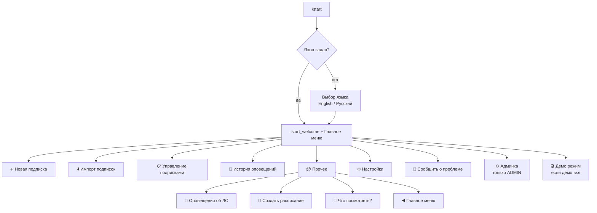
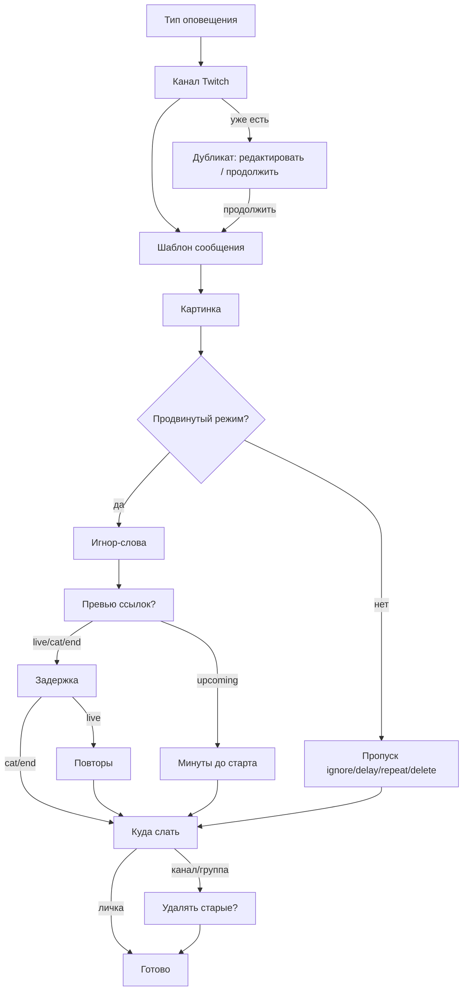
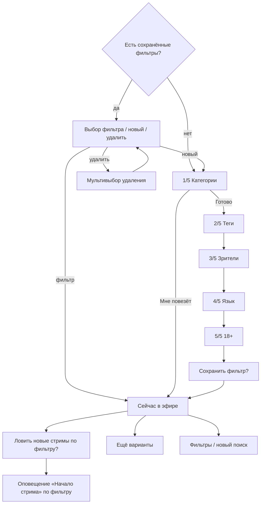

# Карта пользовательских переходов (RU)

Twitch → Telegram бот. Локаль **русский**. Источник: `i18n.py` + `bot.py`.
Дата обновления карты: **2026-08-24**.

Легенда:

| Тип | Значение |
|---|---|
| **Reply** | Кнопки под полем ввода (ReplyKeyboard) |
| **Inline** | Кнопки под сообщением |
| **Текст** | Пользователь вводит сообщение |
| **END** | Выход из мастера → главное меню / ожидание |

Общая навигация мастеров: Reply/Inline **`« Назад`**, **`Отменить`** (или `/cancel`) → предыдущий шаг / отмена.

---

## Обзор главного меню

---

## 1. Старт и главное меню

### 1.1 Выбор языка (если locale не задан)

| | |
|---|---|
| Вход | `/start`, `/help`, `/settings` без языка |
| Текст | `Выберите язык / Choose your language:` |
| Inline | `English` · `Русский` |
| Далее | `Язык: русский.` → welcome / help / settings |

### 1.2 Welcome

| | |
|---|---|
| Вход | `/start` (язык есть) или выбор языка при первом `/start` |
| Текст 1 | Приветствие + подсказка `/help` и «Новая подписка» |
| Reply | Главное меню |
| Текст 2 (только первый `/start`) | Демо подписка на `marfapr` — «без настройки увидеть, как работает бот» |
| Inline (только первый `/start`) | `Перейти к оповещению` → редактор «Что изменить?» · `Удалить подписку` → удаление |

При первом запуске бот автоматически создаёт оповещение о **начале стрима** на [marfapr](https://www.twitch.tv/marfapr) с настройками по умолчанию (шаблон импорта, личка, превью ссылок выкл.).

### 1.3 Главное меню

Текст при возврате: **`Главное меню`**

| Reply-кнопка | Переход |
|---|---|
| `➕ Новая подписка` | Мастер создания (§2) |
| `⬇️ Импорт подписок` | Импорт (§3) |
| `📋 Управление подписками` | Подменю подписок (§4) |
| `📜 История оповещений` | История (§7) |
| `📦 Прочее` · `⚙️ Настройки` | Один ряд; §1.4 / §8 |
| `🐛 Сообщить о проблеме` | §10 |
| `⚙️ Админка` | Только `ADMIN_USER_IDS`, не в демо (§11) |
| `🎬 Демо режим` | Если демо уже активно (переключатель) |

Команды: `/help` (справка + меню), `/cancel`, `/schedule`, `/feedback`, `/settings`.

### 1.4 Прочее

Текст: **`Прочее:`** Два ряда.

| Reply-кнопка | Переход |
|---|---|
| `💬 Оповещения об ЛС` · `📅 Создать расписание` | Один ряд; ЛС / расписание стрима (§5) |
| `🎲 Что посмотреть?` · `◀️ Главное меню` | Один ряд; подбор стримов (§6) / главное меню |

Inline на экране ЛС: `⬜️/✅ Включить`. Первое включение — OAuth Twitch (`user:read:whispers`). Входящее whisper: отправитель, текст, ссылка на переписку.

---

## 2. ➕ Новая подписка

Ветки по типу (после выбора типа):

| Тип | Задержка | Повторы | Напоминание по Twitch schedule | Удаление старых |
|---|---|---|---|---|
| Начало стрима | adv | adv | нет | adv (канал/группа) |
| Смена категории | adv | нет | нет | adv + «и другие оповещения» |
| Окончание стрима | adv | нет | нет | adv |
| Предстоящий стрим | нет | нет | обязательно минуты | adv |

Не-live типы и шаги delay/ignore/repeat/delete — через Premium / gate. Простой режим (продвинутый выкл) пропускает ignore / delay / repeat / delete.

### 2.1 Тип оповещения

| | |
|---|---|
| Текст | Описание типов (+ заметка про простой режим, если выкл.) |
| Inline | `Начало стрима` · `Смена категории` · `Предстоящий стрим` · `Окончание стрима` · `Отменить` |
| Далее | Канал / Premium gate / END |

### 2.2 Канал

| | |
|---|---|
| Reply | `« Назад` · `Отменить` |
| Текст | Введите канал Twitch (логин / ссылка) |
| Далее | Дубликат → меню; иначе шаблон. Upcoming без schedule на Twitch → ошибка |

### 2.3 Дубликат канала

| Inline | Далее |
|---|---|
| `✏️ Перейти к редактированию` | Редактор подписки |
| `➡️ Продолжить` | Шаблон |

### 2.4 Шаблон

| | |
|---|---|
| Текст | Канал найден + примеры плейсхолдеров |
| Inline | `❌/✅ Очистка` · `🎲 Мне повезёт` · `« Назад` · `Отменить` |
| Текст пользователя | Свой шаблон → картинка (или подтверждение опечаток) |
| Lucky | `✅ Продолжить` · `🎲 Мне повезёт` · `🛠 Перейти к полному мастеру` |

### 2.5 Картинка

| Шаг | Текст / кнопки |
|---|---|
| Спрос | Inline `🖼 Добавить` · `Пропустить` |
| Загрузка | Пришлите изображение |
| Позиция | `⬆️ В начале` · `⬇️ В конце` |

### 2.6 Игнор-слова (продвинутый + Premium)

| Inline | `❌/✅ Использовать глобальный список` · `Пропустить` · `« Назад` · `Отменить` |
|---|---|
| Далее | Превью ссылок (если в шаблоне URL и нет картинки) → delay / upcoming minutes |

### 2.7 Превью ссылок

Inline: `✅ Показывать превью` · `❌ Скрыть превью`

### 2.8 Задержка (adv + Premium; не для пути upcoming→minutes)

Inline: `✅ Да` · `❌ Нет` → при Да: ввод минут + Reply `« Назад`/`Отменить`

### 2.9 Повторы (adv + Premium; **только live**)

Inline: `✅ Да, разрешить повторы` · `❌ Нет` → при Нет: минуты заглушки

### 2.10 Куда слать

| Inline | Далее |
|---|---|
| `📩 В личку` | Финиш (без delete_old) |
| `📢 В канал` | Инструкция → переслать/указать канал → delete_old |
| `💬 В группу или сообщество` | Аналогично |

### 2.11 Удалять старые (adv + Premium; канал/группа)

| Inline | `✅ Да, удалять` · `❌ Нет` |
|---|---|
| Смена категории + другие алерты | `✅ Да — удалять все` · `❌ Нет — только смену категории` |
| Уведомлять о сбое удаления | `✅ Да` · `❌ Нет` |
| Финиш | Оповещение создано / на паузе |

### 2.12 Premium gate (по пути)

| Inline | `Оформить премиум` · в начале: `Отменить` · в середине: `Пропустить` |
|---|---|

---

## 3. ⬇️ Импорт подписок

| Шаг | Текст / кнопки | Далее |
|---|---|---|
| OAuth | Inline `Авторизоваться на Twitch` | Браузер → callback |
| Режим | `🔄 Синхронизировать` · `⬇️ Одноразовый импорт` | Период / импорт |
| Период sync | Текст: дни 1–365 | Sync включён |
| Результат | Список + опционально `✅ Включить все` | Меню |

---

## 4. 📋 Управление подписками

Текст: **`Управление подписками:`** Кнопки по два в ряд (последний ряд — `◀️ Главное меню`, если нечем заполнить пару).

| Reply | Далее |
|---|---|
| `📋 Мои подписки` | Выбор типа (если несколько) → список с `⏸ Выкл` / `✅ Вкл` |
| `✏️ Редактировать` | Тип → выбор → «Что изменить?» |
| `🗑 Удалить подписку` | Тип → (опционально `🧺 Корзина` для участников беты) → мультивыбор → удалить |
| `⏸ Приостановить оповещения` | Бета `pause-notifications`. Текст про период в днях → ввод числа (0 = снова включить) · Reply `Отменить` |
| `◀️ Главное меню` | Главное меню |

Пауза оповещений (бета `pause-notifications`): подписки остаются активными, бот просто не доставляет пользователю стримовые и системные сообщения до указанной даты. Включение: **Настройки → 🧪 Бета-режим**.

### Редактирование — inline-пункты (зависят от типа и продвинутого режима)

`📝 Шаблон…` · `🖼 Добавить/Обновить` · `🗑 Удалить изображение` · `🚫 Игнорировать…` · `🔗 Превью…` · `⏱ Задержка…` · `🔁 Повторные…` · `📅 Напоминания…` · `📍 Куда…` · `🗑 Удалять старые` · …

Редакторы полей переиспользуют промпты создания → сохранение → END.

### Удаление

Inline: отметки `✅ 🗑 #N …` · `🗑 Удалить выбранные ({count})` · `Сбросить` · `🧺 Корзина`

Корзина (удалённые, бета `deleted-subscriptions-cart`): список по последним `10/30` дням (free/premium) → мультивыбор → `♻️ Восстановить выбранные`. Включение: **Настройки → 🧪 Бета-режим**. À la carte в Premium — только после GA.

---

## 5. 📅 Создать расписание (`/schedule`)

Вход: **📦 Прочее** → `📅 Создать расписание` или команда `/schedule`.

| Шаг | Кнопки / ввод |
|---|---|
| Выбор режима | `Создать расписание на неделю` · `Поправить слоты на день` |
| (Неделя) Intro + подтверждение | `✅ Создать` · `❌ Отменить` |
| (Неделя) Игра на день | Текст игры · `Стрим не планируется` · `Завершить` · `Отменить` |
| (Неделя) Время | `ЧЧ:ММ` |
| (Неделя) Ещё слот? | `✅ Да` (тот же день) · `❌ Нет` (следующий день) |
| (День) На какой день | `ПН` · `ВТ` · `СР` · … (оставшаяся текущая неделя, включая сегодня) |
| (День) Занятые слоты | список слотов · `✏️ Редактировать` · `➕ Добавить слот` · `Готово` |
| (День) Игра / время | как в недельном мастере; после слота — `Добавить ещё слот?` |
| Публикация на Twitch | `✅ Опубликовать на Twitch` · `❌ Нет` |
| Длительность | `1 ч` … `4 ч` · `Не уверен` |
| OAuth | `Авторизоваться на Twitch` |

Недельная публикация очищает всё расписание на Twitch. Правка дня добавляет/обновляет слоты; затираются только пересекающиеся.

---

## 6. 🎲 Что посмотреть?

Вход: **📦 Прочее** → `🎲 Что посмотреть?`.

### Выбор фильтра

| | |
|---|---|
| Текст | `Выберите сохранённый фильтр или начните новый поиск:` |
| Inline | имена фильтров · `➕ Новый поиск` · `🗑 Удалить фильтры` |

### Шаги мастера

| Шаг | Текст (начало) | Кнопки / ввод |
|---|---|---|
| 1/5 | `Что посмотреть — шаг 1/5` | Текст категории; Inline `🎲 Мне повезёт` · `Готово` · `Очистить список`; Reply `Отменить` |
| 2/5 | `Что посмотреть — шаг 2/5` | Текст тегов; Inline `Пропустить` · `« Назад` · `Отменить` |
| 3/5 | `Что посмотреть — шаг 3/5` | `100-500` / число; Inline `Любое` · нав |
| 4/5 | `Что посмотреть — шаг 4/5` | `Любой язык` · `Русский` · `English` · `Другой код…` · нав |
| 5/5 | `Что посмотреть — шаг 5/5` | `Исключить 18+` · `Разрешить 18+` · нав |
| Save | `Сохранить как фильтр…` + summary | `Сохранить фильтр` · `Только сейчас` · нав |
| Результат | `Сейчас в эфире:` / VOD / пусто | `Ловить новые стримы по фильтру?` · `Ещё варианты` · `Фильтры / новый поиск` |

`Мне повезёт`: индикатор «Ищем стримы…»; 5 игр IGDB random → live язык бота / любой; затем 5 **случайных** из recently released → live; затем 5 **случайных** из [IGDB top-100](https://www.igdb.com/top-100/games) → live; если пусто — VOD по категориям всех наборов (язык бота / любой); 18+ включены.

Оповещение по фильтру: тип «Начало стрима», в списке редактирования видно, править нельзя — только удалить.

---

## 7. 📜 История оповещений

| | |
|---|---|
| Заголовок | История за 7 дн. (free) / 60 дн. (Premium) |
| Пусто | `Оповещений пока нет.` + опционально `Ещё` → Premium |
| Типы в строках | `В эфире` · `Эфир окончен` · `Смена категории` · `Напоминание о стриме` |
| Ссылки | Переход к стриму / сообщению |
| Нав | Страницы; `Ещё` для free |

---

## 8. ⚙️ Настройки

Текст: **`Настройки:`**

| Reply | Экран |
|---|---|
| `⭐ Премиум` | Тарифы / триал / marfapr / функции / оферта |
| `🔄 Синхронизировать` | Вкл/выкл + период + «сейчас» |
| `🚫 Игнорируемые слова` | Глобальный список (текст / очистить) |
| `🎛 Продвинутый режим` | Вкл/выкл (Premium) |
| `🧪 Бета-режим (n/m)` | Список бета-функций: присоединиться / GitHub Issue. `n` — в скольких бетах участвует пользователь, `m` — сколько тестов доступно |
| `🔔 Системные уведомления` | Тумблеры рассылок |
| `🌐 Выбор языка` · `🤝 Партнёрка` | Один ряд |
| `◀️ Главное меню` | Главное меню |

### Бета-режим (inline)

Для каждой активной фичи (`stage`: alpha/beta): `⬜️/✅ Присоединиться: …` · `🐛 Сообщить об ошибке` (GitHub Issues, label `beta/<slug>`). Админам все бета-функции включены; toggle недоступен. Premium-фичи бесплатны только на время beta; после GA — обычные правила Premium.

### Чат стримов Twitch (бета `stream-chat`)

После opt-in в бета-режиме: **Menu Button** слева у поля ввода — **`Чат`** → Mini App (`/app/chat/`).

| Экран | Содержание |
|---|---|
| Home | Поиск по имени / ссылке (`twitch.tv`, `m.twitch.tv`); список live среди **активных** подписок |
| Chat | Сначала Twitch **embed** (для Premium / beta-grant); кнопка **Простой** — IRC fallback + отправка через Helix |
| Auth | Telegram `initData` автоматически; Twitch OAuth из шапки мини-аппа (нужен для отправки в fallback) |

Лимиты: бесплатно чтение + **20 сообщений/сутки** (UTC); Premium-фича `stream_chat` / полный план — без лимита и prefer embed. Оффлайн после поиска — чат не открывается. À la carte в «Оплатить только нужные функции» **не показывается**, пока бета не вышла в GA (то же для корзины `deleted_subscriptions_cart`).

### Премиум (inline, примеры)

`Пробный период` · `Создать подписку на marfapr` · `Подписка на месяц — {stars} ⭐` · год · пожизненная · `Оплатить только нужные функции` · `Купленные подписки` · `Оферта`

### Системные уведомления (тумблеры)

`Оповещения об обновлении бота` · доступность (бот / Twitch) · прочие · синхронизация

### Синхронизация

| Состояние | Inline |
|---|---|
| Выкл | Включить / настроить |
| Вкл | `🔄 Синхронизировать сейчас` · `⏱ Изменить период` · `⏸ Отключить синхронизацию` |

При отписке: неотредактированные sync-оповещения удаляются сразу; для отредактированных / ручных — вопрос `Удалить оповещения?` · `Да` · `Нет`.

---

## 9. 🤝 Партнёрка

Текст: **`Партнёрская программа:`** (+ intro)

| Reply | Действие |
|---|---|
| `📈 Моя статистика` | Баланс / рефералы |
| `🔗 Получить ссылку` | `t.me/…?start=ref_…` |
| `💸 Запросить вывод` | Заявка (≥ мин. Stars) → уведомление админу |
| `📋 Мои заявки` | Статусы |
| `◀️ Настройки` | Настройки |

---

## 10. 🐛 Сообщить о проблеме (`/feedback`)

Текст: контакты / GitHub Issues / донаты / ваш user id. Reply: главное меню. END.

---

## 11. ⚙️ Админка

Текст: **`Админка:`** Два ряда + назад.

| Reply | Далее |
|---|---|
| `📣 Рассылка` · `📊 Статистика` | Один ряд; подменю рассылки / текст `bot_stats` |
| `💸 Выводы` · `🎬 Демо режим` | Один ряд; заявки / вкл-выкл демо |
| `◀️ Главное меню` | Главное меню |

### Рассылка

| Reply | |
|---|---|
| `➕ Новая рассылка` | Тип → аудитория → текст → календарь/время → отправка |
| `📅 Запланированные сообщения` | Список / правка / удаление |
| `◀️ Главное меню` | |

Типы рассылки: обновления · доступность · прочие.  
Аудитория (прочие): указать ID / всем.  
Календарь: дата, час, минуты, `Отправить сейчас`, `Применить время`.

---

## 12. Уведомления пользователю (вне меню)

Не кнопки меню, но переходы в UX:

| Событие | Куда |
|---|---|
| Старт / конец / смена категории / напоминание | ЛС / канал / группа по подписке |
| Twitch Status (если вкл.) | ЛС |
| Админ-рассылка | ЛС |
| Заявка на вывод (админу) | ЛС админа + inline действия |
| PostHog Issue created/reopened | ЛС админа (RU + ссылка) |

---

## Примечания

1. Точные строки кнопок — из `i18n.py` → `"ru"`. EN-локаль зеркалит структуру другими подписями.
2. Продвинутый режим и Premium скрывают/блокируют часть шагов; gate показывает `Оформить премиум` / `Пропустить`.
3. После `Отменить` / `/cancel`: текст отмены + главное меню.
4. Карта описывает **экраны и переходы**, не внутренние job/polling (Helix ~60 с и т.п.).

---

Код подготовлен с помощью Cursor  

Поддержка проекта: [Донат](https://www.donationalerts.com/r/themarfa) · [Донат криптой](https://nowpayments.io/donation/themarfa)
